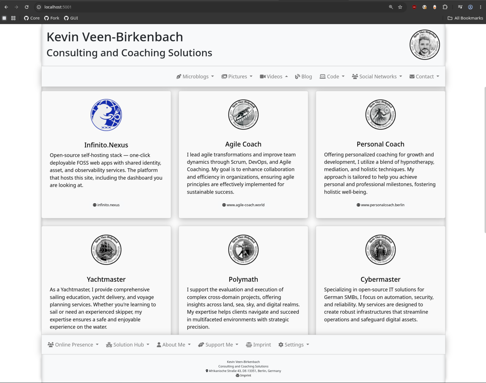

# PortUI 🖥️✨

[](https://github.com/sponsors/kevinveenbirkenbach) [](https://www.patreon.com/c/kevinveenbirkenbach) [](https://buymeacoffee.com/kevinveenbirkenbach) [](https://s.veen.world/paypaldonate)

A lightweight, Docker-powered portfolio/landing-page generator—fully customizable via YAML! Showcase your projects, skills, and online presence in minutes.  



> 🚀 You can also pair PortUI with JavaScript for sleek, web-based desktop-style interfaces.  
> 💻 Example in action: [CyMaIS.Cloud](https://cymais.cloud/) (demo)  
> 🌐 Another live example: [veen.world](https://www.veen.world/) (Kevin’s personal site)

---

## ✨ Key Features

- **Dynamic Navigation**  
  Create dropdowns & nested menus with ease.  
- **Customizable Cards**  
  Highlight skills, projects, or services—with icons, titles, and links.  
- **Smart Cache Management**  
  Auto-cache assets for lightning-fast loading.  
- **Responsive Design**  
  Built on Bootstrap; looks great on desktop, tablet & mobile.  
- **YAML-Driven**  
  All content & structure defined in a simple `config.yaml`.  
- **CLI Control**  
  Manage Docker containers via the `portfolio` command.

---

## 🌐 Quick Access

- **Local Preview:**  
  [http://127.0.0.1:5000](http://127.0.0.1:5000)

---

## 🏁 Getting Started

### 🔧 Prerequisites

- Docker & Docker Compose  
- Basic Python & YAML knowledge  

### 🛠️ Installation via Git

1. **Clone & enter repo**  
   ```bash
   git clone <repository_url>
   cd <repository_directory>
   ```

2. **Configure**
   Copy `config.sample.yaml` → `config.yaml` & customize.
3. **Build & run**

   ```bash
   docker-compose up --build
   ```
4. **Browse**
   Open [http://localhost:5000](http://localhost:5000)

### 📦 Installation via Kevin’s Package Manager

```bash
pkgmgr install portui
```

Once installed, the `portui` CLI is available system-wide.

---

## 🖥️ CLI Commands

```bash
portui --help
```

* `build` Build the Docker image
* `up` Start containers (with build)
* `down` Stop & remove containers
* `run-dev` Dev mode (hot-reload)
* `run-prod` Production mode
* `logs` View container logs
* `dev` Docker-Compose dev environment
* `prod` Docker-Compose prod environment
* `cleanup` Prune stopped containers

---

## 🔧 YAML Configuration Guide

Define your site’s structure in `config.yaml`:

```yaml
accounts:
  name: Online Accounts
  description: Discover my online presence.
  icon:
    class: fa-solid fa-users
  children:
    - name: Channels
      description: Platforms where I share content.
      icon:
        class: fas fa-newspaper
      children:
        - name: Mastodon
          description: Follow me on Mastodon.
          icon:
            class: fa-brands fa-mastodon
          url: https://microblog.veen.world/@kevinveenbirkenbach
          identifier: "@kevinveenbirkenbach@microblog.veen.world"
  cards:
    - icon:
        source: https://cloud.veen.world/s/logo_agile_coach_512x512/download
      title: Agile Coach
      text: I lead agile transformations and improve team dynamics through Scrum and Agile Coaching.
      url: https://www.agile-coach.world
      link_text: www.agile-coach.world

company:
  title: Kevin Veen-Birkenbach
  subtitle: Consulting & Coaching Solutions
  logo:
    source: https://cloud.veen.world/s/logo_face_512x512/download
  favicon:
    source: https://cloud.veen.world/s/veen_world_favicon/download
  address:
    street: Afrikanische Straße 43
    postal_code: DE-13351
    city: Berlin
    country: Germany
  imprint_url: https://s.veen.world/imprint
```

* **`children`** enables multi-level menus.
* **`link`** references other YAML paths to avoid duplication.

---

## 🚢 Production Deployment

* Use a reverse proxy (NGINX/Apache).
* Secure with SSL/TLS.
* Swap to a production database if needed.

---

## 📜 License

Licensed under **GNU AGPLv3**. See [LICENSE](./LICENSE) for details.

---

## ✍️ Author

Created by [Kevin Veen-Birkenbach](https://www.veen.world/)

Enjoy building your portfolio! 🌟
